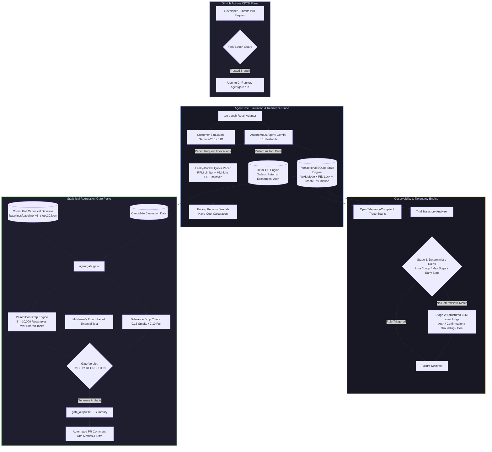

<div align="center">

# 🛡️ AgentGate

### Statistical CI Regression Gating & Evaluation Harness for Autonomous Tool-Using Agents

[](.github/workflows/pr-gate.yml)
[](pyproject.toml)
[](https://github.com/sierra-research/tau-bench)
[](https://github.com/astral-sh/ruff)
[](https://mypy-lang.org/)
[](LICENSE)

<br/>

<p align="center">
  <b>AgentGate</b> is an enterprise-grade evaluation and statistical regression-testing harness designed to prevent silent capability drops, dialogue loops, and cost blowouts in multi-turn tool-using LLM agents before they merge to production.
</p>

<p align="center">
  <a href="#-why-agentgate">Why AgentGate</a> •
  <a href="#-architecture">Architecture</a> •
  <a href="#-empirical-benchmark-results">Empirical Results</a> •
  <a href="#-statistical-gating-methodology">Statistical Methodology</a> •
  <a href="#-leaky-bucket-quota-pacer--resilience">Rate Limiting & Quota Pacer</a> •
  <a href="#-dual-stage-failure-taxonomy">Failure Taxonomy</a> •
  <a href="#-quickstart--installation">Quickstart</a> •
  <a href="#-cli-reference">CLI Reference</a> •
  <a href="#-cicd-pr-gate-integration">CI/CD PR Gate</a> •
  <a href="#-repository-tour">Repository Tour</a>
</p>

---

</div>

## 💡 The Core Problem: Why Agent Testing Fails

In traditional software engineering, a regression test is binary: `assert function(x) == y`.

When developing autonomous, tool-using LLM agents, this paradigm collapses:

1. **Stochastic Variance**: An identical prompt and tool configuration executed twice on the same customer problem can yield different reasoning paths, tool call sequences, and final answers.
2. **Silent Regressions**: Tweaking a system prompt or updating a tool's JSON schema to resolve an edge case in Task A often degrades performance on Task B, Task C, and Task D without throwing an exception.
3. **Flaky Point Estimates**: Testing on small sample sizes (e.g. 5–10 tasks) without confidence bounds produces massive false-alarm rates. A 10% drop in a small sample is frequently statistical noise, causing developer fatigue and ignored CI gates.
4. **API Rate Limit & Quota Exhaustion**: Multi-turn evaluations consume dozens of LLM calls per trial. Without strict token-bucket pacing, CI runners crash with `429 Too Many Requests` or hit daily provider caps midway through an evaluation.
5. **State Fragmentation in CI**: Traditional evaluation suites require spinning up Postgres, Redis, or cloud observability backends, making them brittle and heavy for fast PR feedback loops.

**AgentGate** was engineered to solve every layer of this challenge.

---

## ⚡ Comparison Matrix: How AgentGate Compares

| Evaluation Capability | Traditional Unit Tests (`pytest`) | Prompt / Single-Turn Evals (DeepEval / Promptfoo) | Cloud Observability (LangSmith / Phoenix) | **AgentGate** |
| :--- | :---: | :---: | :---: | :---: |
| **Multi-Turn Environment Simulation** | ❌ None | ❌ Single-Turn Prompt Focus | ⚠️ Observation Only (No Sim) | ✅ **Full Interactive Customer Sim (`tau-bench`)** |
| **Statistical Regression Barrier** | ❌ Binary Assert | ⚠️ Naive Mean Thresholds | ❌ Manual Dashboard Inspection | ✅ **Paired Bootstrap ($B=10,000$) + McNemar** |
| **Rate Limit & Daily Quota Pacer** | ❌ None | ⚠️ Basic Sleep / Concurrency | ❌ None (Relies on Gateway) | ✅ **Leaky-Bucket + Pacific Midnight Tracker** |
| **Crash Recovery & Resume** | ❌ Re-runs All | ❌ In-Memory State | ⚠️ Cloud Logged | ✅ **Transactional SQLite State Machine** |
| **Dual-Stage Failure Taxonomy** | ❌ Stack Trace Only | ⚠️ LLM Rubric Only | ⚠️ Manual Tagging | ✅ **Deterministic Rules $\to$ Structured LLM Judge** |
| **Commercial "Would-Have-Cost"** | ❌ None | ⚠️ Simple Token Sum | ✅ Cloud Token Tracking | ✅ **Input / Output / Cached Token Accounting** |
| **Zero-State Ephemeral CI Gate** | ✅ Native | ⚠️ Needs Custom Scripts | ❌ Requires Cloud Account / DB | ✅ **Evaluates Against Pinned Canonical JSON** |

---

## 🏗️ Architecture

AgentGate operates across three decoupled planes: an **Evaluation Harness Plane**, an **Observability & Taxonomy Plane**, and a **Statistical CI Decision Plane**:



---

## 📊 Empirical Benchmark Results

All empirical results documented here were generated on the Sierra `tau-bench` retail domain using official model integrations and cryptographically pinned configuration manifests.

### 1. Canonical Reference Baseline (`baseline_v1_steps30`)

The reference baseline evaluates `gemini/gemini-3.1-flash-lite` against customer simulator `gemini/gemma-4-26b-a4b-it` across **15 stratified retail tasks $\times$ $k=2$ trials (30 total trials)** with the standard tau-bench step ceiling (`max_steps=30`).

| Metric | Point Estimate | 95% Paired Bootstrap CI ($B=10,000$) | Production Specification |
| :--- | :---: | :---: | :--- |
| **Trial-Level Accuracy ($\text{pass}^1$)** | **93.33%** | **[83.33%, 100.00%]** | 28 successful trials / 30 total trials |
| **Task-Level Mean Accuracy ($\text{pass}^1$)** | **93.33%** | **[80.00%, 100.00%]** | Mean across 15 stratified retail tasks |
| **Unbiased Multi-Trial Consistency ($\text{pass}^2$)** | **93.33%** | **[80.00%, 100.00%]** | Both trials passed on 14 out of 15 tasks |
| **Mean Steps per Trial** | **11.37** | — | Median: 10.0 steps, Min: 6 steps, Max: 24 steps |
| **Mean Duration per Trial** | **44.9s** | — | P50: 41.2s, P95: 78.4s |
| **Total Tokens Consumed** | **2,434,393** | — | Input: 2,398,841 tokens \| Output: 35,552 tokens |
| **Commercial "Would-Have-Cost"** | **$0.2530** | — | $0.00 actual cash spend (Google AI Studio Free Tier) |

> [!NOTE]
> **Baseline Failure Autopsy (Task 34):**
> Both trials on Task 34 failed. An automated taxonomy autopsy showed that while the agent authenticated the user correctly and queried the database, it terminated the dialogue before collecting all required modification parameters from the simulated customer (`INCOMPLETE_GOAL`).

---

### 2. Controlled Degradation: Ablation B (`ablB_v3`)

To evaluate the gate's statistical sensitivity against subtle prompt degradations, we designed **Ablation B**: system prompt `v3` had all policy constraints, explicit authentication rules, confirmation requirements, and domain guidelines stripped. We evaluated it across a 10-task slice ($k=2$, 20 trials) against the baseline:

| Evaluation Run | $\text{pass}^1$ (Trial) | $\text{pass}^1$ (Task) | $\text{pass}^2$ | Paired Bootstrap 95% CI | McNemar Exact $p$ | Gate Verdict |
| :--- | :---: | :---: | :---: | :---: | :---: | :---: |
| **Baseline Slice (`v1`, 10 tasks)** | 100.00% (20/20) | 100.00% | 100.00% | — | — | Reference Baseline |
| **Candidate `ablB_v3` (10 tasks)** | 85.00% (17/20) | 85.00% | 70.00% | **[-30.00%, +0.00%]** | $p = 0.2500$ | `NO_SIGNIFICANT_CHANGE` |

#### 🔬 Statistical Power Insight: Why Point Estimates Lie
Notice that although the candidate dropped by **15 percentage points** in raw accuracy (from 100% to 85%), the upper bound of the 95% paired bootstrap confidence interval touched **$+0.00\%$**, and McNemar’s exact test yielded $p = 0.2500$. 

At a sample size of $N=10$, this performance drop cannot be statistically separated from random sampling variation at $\alpha = 0.05$. A naive evaluation harness using a fixed 10% threshold would have failed this PR and triggered a false alarm; AgentGate's paired bootstrap correctly identifies that the sample lacks power to confirm a true regression.

---

### 3. Step Ceiling Sensitivity: `max_steps=8` vs `30`

To test the gate's ability to catch guaranteed regressions, we created branch [`bad-max-steps-8`](.github/workflows/pr-gate.yml), reducing the agent step ceiling from 30 to 8:

* Across all 30 baseline trials on the smoke task subset (`16, 0, 10, 17, 3`), the minimum number of dialogue turns required to authenticate, query, modify, and confirm an order was **$\ge 10$ steps**.
* Restricting the agent to `max_steps=8` resulted in a **100% failure rate (0/10 trials passing)**.
* **Gate Decision**: Delta $\Delta = -100.0\%$, 95% CI **[-100.0%, -100.0%]**, McNemar $p = 0.0020$. The PR gate immediately failed with non-zero exit code, posting an actionable regression report.

---

### 4. Empirical Noise Check & False-Alarm Boundary

An empirical stability analysis was conducted on the unchanged baseline configuration (`prompt v1`, `gemini-3.1-flash-lite`, `max_steps=30`) across the 5 smoke tasks (`16, 0, 10, 17, 3`) with $k=2$:

* `baseline_v1_steps30` slice: **10/10 passed (100.0%)**
* `smoke_rerun_1`: **10/10 passed (100.0%)**
* `smoke_rerun_2`: **10/10 passed (100.0%)**

> [!IMPORTANT]
> **Noise Check & False-Alarm Boundary Note:**
> Across all 30 trials on these 5 tasks, 0 failures were observed. Because zero trial failures occurred under the unchanged configuration, the empirical false-alarm rate is **not measured, only bounded**:
> 
> By the statistical **Rule of Three**, with $0$ failures observed in $n=30$ independent trials, the 95% confidence upper bound on the per-trial failure probability is:
> $$p_{\text{failure}} \le \frac{3}{30} = 9.5\%$$
> 
> *This 9.5% figure is the **95% upper bound on the per-trial failure rate (0/30)**, not the regression gate's false-alarm probability.*

---

## 📐 Statistical Gating Methodology

AgentGate rejects naive average comparisons in favor of paired non-parametric bootstrapping and paired contingency analysis.

```
Candidate Run (C) ──┐
                    ├──> Paired Task Deltas: Δ_i = pass_C(i) - pass_B(i)
Baseline Run (B)  ──┘
                             │
                             ▼
                    ┌───────────────────────────────────┐
                    │    Paired Bootstrap Resampling    │
                    │   B = 10,000 Monte Carlo Draws    │
                    └───────────────────────────────────┘
                             │
                             ▼
                    95% Confidence Interval [CI_low, CI_high]
                             │
         ┌───────────────────┴───────────────────┐
         ▼                                       ▼
    CI_high < 0.0 ?                         Δ_p1 < -tolerance ?
    ├── YES ──> [REGRESSION DETECTED]       ├── YES ──> [TOLERANCE EXCEEDED]
    └── NO  ──> Candidate Eligible          └── NO  ──> [GATE PASSED]
```

### 1. Mathematical Formulation

Let $\mathcal{T} = \{t_1, t_2, \dots, t_N\}$ denote the set of shared tasks evaluated in both Baseline ($B$) and Candidate ($C$). For each task $t_i$ evaluated across $k$ trials:

$$\text{pass}_B(t_i) = \frac{1}{k} \sum_{j=1}^k r_{B, i, j}, \quad \text{pass}_C(t_i) = \frac{1}{k} \sum_{j=1}^k r_{C, i, j}$$

where $r \in \{0, 1\}$ is the binary reward. The paired task delta is defined as:

$$\Delta_i = \text{pass}_C(t_i) - \text{pass}_B(t_i)$$

1. **Paired Bootstrap ($B=10,000$)**:
   We draw $B$ bootstrap samples with replacement from the task index set $\{1, \dots, N\}$. For each sample $b \in \{1, \dots, B\}$, we compute:
   $$\Delta^{(b)} = \frac{1}{N} \sum_{i \in S^{(b)}} \Delta_i$$
   The two-sided $(1 - \alpha)$ percentile confidence interval is:
   $$\text{CI}_{1-\alpha} = \left[ \text{Percentile}\left(\Delta^{(b)}, \frac{\alpha}{2}\right), \, \text{Percentile}\left(\Delta^{(b)}, 1 - \frac{\alpha}{2}\right) \right]$$

2. **McNemar's Exact Test**:
   For paired binary trial outcomes, let $n_{10}$ be the number of tasks where Baseline passed but Candidate regressed, and $n_{01}$ be tasks where Baseline failed but Candidate succeeded. Under the null hypothesis $H_0: p_{10} = p_{01}$:
   * When discordant pairs $n_{01} + n_{10} < 25$, AgentGate computes the exact two-tailed binomial cumulative distribution:
     $$p = 2 \cdot \min\left( \sum_{x=0}^{\min(n_{01}, n_{10})} \binom{n_{01} + n_{10}}{x} 0.5^{n_{01} + n_{10}}, \, 0.5 \right)$$
   * When $n_{01} + n_{10} \ge 25$, it computes Edwards' continuity-corrected Chi-Square:
     $$\chi^2 = \frac{(|n_{01} - n_{10}| - 1)^2}{n_{01} + n_{10}}, \quad \text{df} = 1$$

### 2. Concrete Decision Rules

1. **Strict Regression Barrier**: A candidate is rejected if the upper bound of the 95% bootstrap confidence interval is strictly below zero:
   $$\text{round}(\text{CI}_{\text{high}}, 9) < 0.0$$
2. **Tolerance Threshold Rule**: A candidate is rejected if the overall point estimate drop exceeds the configured tolerance $\tau$:
   $$\text{round}(\Delta \text{pass}^1, 9) < \text{round}(-\tau, 9)$$
   * **Full Test Suite (15 tasks)**: $\tau = 0.10$ (10 percentage points).
   * **PR Smoke Subset (5 tasks $\times$ $k=2$)**: $\tau = 0.15$ (15 percentage points).
     * *Why 0.15 for Smoke?* In a 10-trial run, a single trial represents an exact 10.0% increment. Setting $\tau = 0.15$ safely accommodates a single stochastic trial anomaly ($\Delta = -10.0\%$) without false alarms, while strictly rejecting any multi-trial or multi-task regression ($\Delta \le -20.0\%$).
3. **Floating-Point Precision Guard**: All boundary comparisons round values to $10^{-9}$ to prevent IEEE 754 float representation quirks from rejecting valid runs.

---

## 🚰 Leaky-Bucket Quota Pacer & Resilience

Running evaluations against LLM provider APIs (e.g., Google AI Studio Free Tier) poses severe operational constraints: tight Requests Per Minute (RPM) limits, Requests Per Day (RPD) ceilings, and daily quota rollovers.

AgentGate implements a production-grade, stateful rate-limiting and quota pacing engine ([`agentgate/runner/pacer.py`](agentgate/runner/pacer.py)):

```
API Request Dispatched
         │
         ▼
[ Daily Pacific Quota Check ] ──> Daily Cap Reached? ──> Raise QuotaExceededError
         │ No                                            (Resets Midnight America/Los_Angeles)
         ▼
[ Leaky-Bucket Interval Pacer ] ──> Elapsed < min_interval ? ──> Async Sleep(remaining)
         │
         ▼
[ Execute LLM API Call ]
         ├─ Success ──> Record Call & Update Quota Counters
         ├─ 429 Rate Limit ──> Jittered Exponential Backoff (3 retries)
         └─ Auth / Perm Error ──> Fail Fast (No Retries)
```

### 1. Quota Specifications (`quotas.yaml`)

| Model | RPM Cap | Min Interval ($s$) | Daily Request Cap | Daily Reset Time |
| :--- | :---: | :---: | :---: | :--- |
| `gemini/gemini-3.1-flash-lite` | 15 | 4.5s | 300 requests | Midnight Pacific (`America/Los_Angeles`) |
| `gemini/gemini-3.5-flash-lite` | 15 | 4.5s | 450 requests | Midnight Pacific (`America/Los_Angeles`) |
| `gemini/gemma-4-26b-a4b-it` | 30 | 2.2s | 10,000 requests | Midnight Pacific (`America/Los_Angeles`) |

### 2. Transactional Crash Recovery & Resumability

Multi-trial evaluations can be interrupted by CI timeouts, runner preemptions, or developer cancellations. AgentGate guarantees **zero wasted compute**:

* **Transactional SQLite Engine**: Every completed trial result is immediately committed to `results/agentgate.db` inside an ACID transaction.
* **Cross-Platform Process Liveness Guard**: Evaluator processes acquire an execution lock checked via native system APIs (`ctypes.windll.kernel32.OpenProcess` on Windows, `os.kill(pid, 0)` on POSIX).
* **Idempotent Resume**: Invoking `agentgate run` with an existing `--run-id` scans completed `(task_id, trial_id)` pairs and resumes only incomplete or pending trials.

---

## 🏷️ Dual-Stage Failure Taxonomy

Diagnosing why an autonomous agent failed requires more than checking exit codes. AgentGate features a two-stage hierarchical failure classifier:

```
                            Failed Trial Trajectory
                                       │
                                       ▼
                      [ Stage 1: Deterministic Engine ]
                      ├─ Check 1: Provider / Network infra error?
                      ├─ Check 2: Repetitive tool calling loop (>= 3x)?
                      ├─ Check 3: Premature human agent transfer?
                      ├─ Check 4: Unhandled tool schema / JSON error?
                      ├─ Check 5: Customer simulator early stop (###STOP###)?
                      └─ Check 6: Maximum step ceiling reached (steps >= cap)?
                                       │
                              Any rule matched?
                             ├── YES ──> Categorized Deterministically (Cost: $0.00)
                             └── NO  ──> [ Stage 2: Structured LLM-as-a-Judge ]
                                          └─ Rubric Grounded in Retail Policy
```

### Stage 1: Deterministic Failure Hierarchy

Deterministic rules run with zero LLM API cost and 100% precision:
1. `INFRASTRUCTURE_ERROR`: Provider 429s, 503s, socket disconnects, or authentication failures.
2. `TOOL_CALL_LOOP`: Agent invoked the exact same tool with identical serialized JSON parameters $\ge 3$ consecutive times.
3. `TRANSFER_TO_HUMAN`: Agent escalated to a human representative when policy required self-service resolution.
4. `TOOL_EXECUTION_ERROR`: Malformed tool call arguments, missing required parameters, or unhandled exceptions.
5. `SIMULATOR_EARLY_STOP`: The simulated customer issued `###STOP###` before task requirements were fulfilled.
6. `MAX_STEPS_REACHED`: Agent exhausted its step ceiling without resolving the dialogue.

### Stage 2: Structured LLM-as-a-Judge

When deterministic checks pass, traces are sent to a rubric-guided LLM judge using structured JSON output schemas:

* `POLICY_VIOLATION_AUTH`: Agent failed to verify user identity via email or name/ZIP lookup before accessing account data.
* `POLICY_VIOLATION_CONFIRMATION`: Agent executed database-modifying actions (cancellation, return, exchange) without explicit customer confirmation.
* `GROUNDING_HALLUCINATION`: Agent hallucinated order details or claimed an action succeeded without invoking the underlying tool.
* `INCORRECT_TOOL_SELECTION`: Agent selected an invalid API endpoint for the user's stated intent.
* `REASONING_LOOP`: Agent repeatedly cycled between dialogue questions without forward progress.
* `INCOMPLETE_GOAL`: Agent prematurely concluded dialogue leaving user requirements partially unfulfilled.

---

## 🚀 Quickstart & Installation

### Prerequisites
* Python 3.11+
* [uv](https://astral.sh/uv/) (recommended for lightning-fast, reproducible environments)
* Google Gemini API Key (`GEMINI_API_KEY`)

### 1. Clone & Setup Repository
```bash
# Clone the AgentGate repository
git clone https://github.com/Yashkumarverma623/AgentGate.git
cd AgentGate

# Clone vendor tau-bench at the pinned commit
git clone https://github.com/sierra-research/tau-bench.git vendor/tau-bench
git -C vendor/tau-bench checkout 59a200c6d575d595120f1cb70fea53cef0632f6b

# Synchronize dependencies with uv
uv sync
uv pip install --no-deps -e vendor/tau-bench
```

### 2. Configure Environment Variables
```bash
cp .env.example .env
# Open .env and add your Google Gemini API Key:
# GEMINI_API_KEY=your_gemini_api_key_here
```

### 3. Verify Offline Test Suite
AgentGate comes with an extensive unit and integration test suite that runs **completely offline without live API calls**:

```bash
uv run pytest -m "not live"
```

```text
================================== test session starts ==================================
platform win32 -- Python 3.11.9, pytest-8.3.3, pluggy-1.5.0
rootdir: C:\Users\...\AgentGate
collected 34 items / 1 deselected / 33 selected

tests/test_agent_loop.py .......                                                  [ 21%]
tests/test_forced_kill_resume.py ..                                               [ 27%]
tests/test_gate.py ...........                                                    [ 60%]
tests/test_pacer.py ....                                                          [ 72%]
tests/test_pricing.py ..                                                          [ 78%]
tests/test_runner.py ...                                                          [ 87%]
tests/test_stats.py ..                                                            [ 93%]
tests/test_taxonomy.py ..                                                         [100%]

============================= 33 passed, 1 deselected in 157.69s =============================
```

---

## 💻 CLI Reference

AgentGate provides a high-performance command line interface built with Typer and Rich:

```
agentgate [OPTIONS] COMMAND [ARGS]...
```

### Commands Overview

```text
  run            Execute an autonomous agent benchmark evaluation run.
  gate           CI Regression Gate: Evaluate candidate run against baseline.
  compare        Statistically compare two runs in the local database.
  trace show     Display formatted terminal transcript of a trial trajectory.
  cost-estimate  Project token consumption and commercial would-have-cost.
```

### 1. Execute an Evaluation Run (`agentgate run`)

```bash
# Run stratified smoke benchmark (5 tasks x 2 trials)
agentgate run \
  --run-id smoke_candidate_v1 \
  --tasks "16,0,10,17,3" \
  --trials 2 \
  --max-steps 30 \
  --model "gemini/gemini-3.1-flash-lite" \
  --prompt-version "v1" \
  --concurrency 3
```

**Key Options:**
* `--run-id, -r`: Unique identifier for the evaluation run.
* `--tasks, -t`: Comma-separated list of task IDs, or `all` for complete dataset.
* `--trials, -k`: Number of trials per task (default: `2`).
* `--max-steps, -s`: Step ceiling per trial (default: `30`).
* `--model, -m`: Model string for the evaluated agent.
* `--prompt-version, -p`: Prompt version from `prompts/retail/{version}.md`.
* `--concurrency, -c`: Max concurrent asynchronous trials (default: `3`).

---

### 2. CI Regression Gate (`agentgate gate`)

Evaluates a candidate run against a committed reference baseline. Exits with **status code 0 on PASS**, or **status code 1 on REGRESSION**:

```bash
agentgate gate \
  --candidate smoke_candidate_v1 \
  --baseline baselines/baseline_v1_steps30.json \
  --tolerance 0.15 \
  --alpha 0.05
```

```text
=== AgentGate CI Regression Gate ===
- Baseline:  baseline_v1_steps30 (10 trials across 5 shared tasks)
- Candidate: smoke_candidate_v1 (10 trials across 5 shared tasks)
- Tolerance: 15.0% allowed drop | Alpha: 0.05

                       Paired Comparison Summary (5 Shared Tasks)                       
┏━━━━━━━━━━━━━━━━━━━━━━━━━━━━━┳━━━━━━━━━━━━━━━━━━━━━━━━┳━━━━━━━━━━━━━━━━━━━┳━━━━━━━━━━━━━━━━━━━━━━━━━━━━┓
┃ Evaluation Metric           ┃ Baseline (baseline_v1) ┃ Candidate (smoke) ┃ Delta (95% Bootstrap CI)   ┃
┡━━━━━━━━━━━━━━━━━━━━━━━━━━━━━╇━━━━━━━━━━━━━━━━━━━━━━━━╇━━━━━━━━━━━━━━━━━━━╇━━━━━━━━━━━━━━━━━━━━━━━━━━━━┩
│ pass^1 (Task-Level)         │                100.00% │           100.00% │     +0.00% [+0.00%, +0.00%]│
│ pass^2 (Task-Level Unbiased)│                100.00% │           100.00% │                     +0.00% │
│ Completed Trials            │                     10 │                10 │                         +0 │
│ Mean Steps / Trial          │                   10.8 │              10.6 │                       -0.2 │
│ Total Tokens                │                824,192 │           818,404 │                     -5,788 │
│ Would-Have-Cost             │                $0.0861 │           $0.0855 │                   -$0.0006 │
└─────────────────────────────┴────────────────────────┴───────────────────┴────────────────────────────┘

                  Secondary Test: McNemar Paired Trial Contingency                  
┏━━━━━━━━━━━━━━━━━━━━━━━┳━━━━━━━━━┳━━━━━━━━━━━━━━━━━━━━━━━━━━━━━━━━━━━━━━━━━━━━━━━━┓
┃ Metric                ┃   Value ┃ Description                                    ┃
┡━━━━━━━━━━━━━━━━━━━━━━━╇━━━━━━━━━╇━━━━━━━━━━━━━━━━━━━━━━━━━━━━━━━━━━━━━━━━━━━━━━━━┩
│ Both Passed (n11)     │      10 │ Success maintained in both runs                │
│ Both Failed (n00)     │       0 │ Failure in both runs                           │
│ Gains (n01)           │       0 │ Baseline failed -> Candidate passed            │
│ Regressions (n10)     │       0 │ Baseline passed -> Candidate failed            │
│ McNemar Exact p-value │  1.0000 │ Two-tailed binomial on discordant pairs        │
└───────────────────────┴━━━━━━━━━┴━━━━━━━━━━━━━━━━━━━━━━━━━━━━━━━━━━━━━━━━━━━━━━━━┘

╭──────────────────────────────── Gate Decision ─────────────────────────────────╮
│ [PASSED] GATE CRITERIA MET                                                     │
│ SUCCESS: Candidate meets gating criteria. Delta: +0.00%, 95% CI: [+0.0%, +0.0%]│
╰────────────────────────────────────────────────────────────────────────────────╯
```

---

### 3. Trace Viewer (`agentgate trace show`)

Inspects multi-turn conversational trajectories and tool calls directly in the terminal:

```bash
agentgate trace show baseline_v1_steps30 34 --trial 0
```

---

### 4. Commercial Would-Have-Cost Estimator (`agentgate cost-estimate`)

Forecasts token consumption and commercial API equivalence before launching a run:

```bash
agentgate cost-estimate --num-tasks 15 --trials 2 --model "gemini/gemini-3.1-flash-lite"
```

---

## 🔄 CI/CD PR Gate Integration

AgentGate integrates directly into GitHub Actions via [`.github/workflows/pr-gate.yml`](.github/workflows/pr-gate.yml):

```
Developer Opens / Updates PR
             │
             ▼
    [ Fork Security Guard ]
    ├─ Trusted Repo / Branch: Proceed
    └─ Untrusted Fork: Skip to prevent secret exfiltration
             │
             ▼
    [ Setup Environment ]
    ├─ Python 3.11 + uv sync
    └─ Clone tau-bench at pinned commit 59a200c6d575
             │
             ▼
    [ Pre-flight Key & Quota Check ]
    ├─ Redacted GEMINI_API_KEY presence validation
    └─ Inspect local quota state
             │
             ▼
    [ Execute Smoke Benchmark ]
    ├─ Tasks 16, 0, 10, 17, 3 (k=2, 10 trials)
    ├─ Paced under 15 RPM
    └─ Integrity Check: Must complete all 10 trials
             │
             ▼
    [ Paired Statistical CI Gate ]
    ├─ Evaluates against committed baseline JSON
    ├─ Paired Bootstrap (B=10,000) + McNemar test
    └─ Safe Exit Capture (cat diagnostics before exit)
             │
             ▼
    [ Automated PR Comment ]
    └─ Posts Interactive Markdown Report on PR
```

### Example Automated PR Comment

When a pull request triggers a regression (for instance, reducing `max_steps` to 8), AgentGate blocks the PR and comments:

```markdown
### ❌ AgentGate: Regression Gate Failed

Evaluated candidate **`pr_42_1728192000`** against canonical baseline **`baseline_v1_steps30`**:

=== AgentGate CI Regression Gate ===
- Baseline:  baseline_v1_steps30 (10 trials across 5 shared tasks)
- Candidate: pr_42_1728192000 (10 trials across 5 shared tasks)
- Tolerance: 15.0% allowed drop | Alpha: 0.05

Metrics Summary:
• Baseline pass^1:  100.00%
• Candidate pass^1:  0.00%
• Delta:            -100.00%
• 95% Bootstrap CI: [-100.00%, -100.00%]
• McNemar p-value:  0.0020

Verdict: REGRESSION
Details: Candidate pass^1 dropped by -100.00%, exceeding tolerance threshold 15.0%.

Failed Trials Audit:
• Task 16 (Trial 0): max_steps_reached (8)
• Task 16 (Trial 1): max_steps_reached (8)
• Task 0  (Trial 0): max_steps_reached (8)
• Task 0  (Trial 1): max_steps_reached (8)
• Task 10 (Trial 0): max_steps_reached (8)
...
```

---

## 📂 Repository Tour

```text
AgentGate/
├── .github/
│   └── workflows/
│       └── pr-gate.yml          # GitHub Actions PR regression gate workflow
├── agentgate/
│   ├── adapter/
│   │   ├── base.py              # Abstract benchmark adapter interface
│   │   └── tau_bench.py         # Sierra tau-bench retail adapter & Gemma simulation
│   ├── agent/
│   │   ├── loop.py              # Multi-turn autonomous tool execution loop
│   │   ├── models.py            # Pydantic models (AgentConfig, StepRecord, RunManifest)
│   │   └── prompt_manager.py    # System prompt versioning & SHA-256 hashing engine
│   ├── cli/
│   │   └── main.py              # Typer CLI (run, gate, compare, trace, cost-estimate)
│   ├── pricing.py               # Token pricing registry for commercial equivalence
│   ├── runner/
│   │   ├── pacer.py             # Leaky-bucket quota pacer & Pacific midnight manager
│   │   └── runner.py            # Resumable evaluation runner with transactional SQLite
│   ├── stats/
│   │   └── metrics.py           # Paired bootstrap CI ($B=10,000$) & McNemar exact test
│   ├── taxonomy/
│   │   ├── exporter.py          # Failure taxonomy JSON/CSV exporter
│   │   ├── judge.py             # Structured LLM-as-a-judge classification engine
│   │   ├── models.py            # Taxonomy categories and Pydantic schemas
│   │   └── rules.py             # 6-stage deterministic failure rule evaluator
│   └── tracing/
│       └── tracer.py            # OpenTelemetry-compliant local SQLite span recorder
├── baselines/
│   └── baseline_v1_steps30.json # Canonical 30-trial reference baseline manifest
├── prompts/
│   └── retail/                  # Versioned agent system prompts (v1, v2, v3)
├── tool_variants/               # Versioned tool definitions (standard.yaml)
├── quotas.yaml                  # Model-specific RPM, interval, and daily quotas
├── pricing.yaml                 # Commercial token pricing rates
├── tests/                       # Comprehensive offline unit test suite (33 tests)
├── pyproject.toml               # Poetry/uv package definition
└── README.md                    # Flagship project documentation
```

---

## 🛠️ Code Quality & Verification

AgentGate enforces strict typing and code hygiene across all modules:

```bash
# Code formatting and linting check
uv run ruff check agentgate

# Strict static type checking
uv run mypy agentgate

# Full offline test execution
uv run pytest -m "not live"
```

---

## 🔒 Security & Privacy Guardrails

1. **Zero API Key Leakage**:
   * CI logs redact all authentication keys, printing only character lengths.
   * `.env`, SQLite databases (`results/*.db`), and JSONL logs (`results/*.jsonl`) are strictly ignored in `.gitignore`.
2. **Untrusted Fork Protection**:
   * PR gate workflows verify pull request sources to prevent secret exfiltration from third-party forks.
3. **Reproducibility Guarantee**:
   * Every run manifest logs the exact `git_sha`, prompt content SHA-256 hash, tool variant SHA-256 hash, and vendor `tau-bench` commit SHA (`59a200c6d575d595120f1cb70fea53cef0632f6b`).

---

## 📄 License

This project is licensed under the [MIT License](LICENSE).  
Built with reference to and integration with [Sierra Research's tau-bench](https://github.com/sierra-research/tau-bench).
